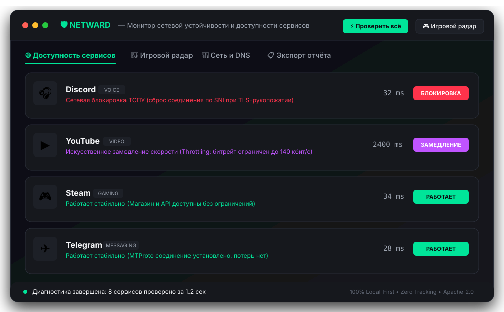
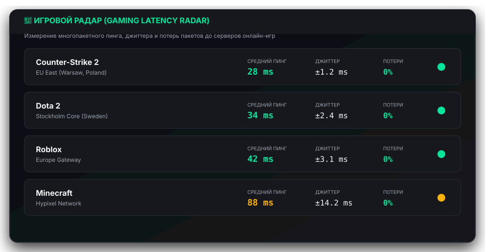

<div align="center">

# 🌐 Выбор языка / Language Selection

<p>
  <a href="README.ru.md"></a>
  <a href="README.md"></a>
</p>

---

<p align="center">
  
</p>

### Современный open-source монитор сетевой устойчивости и диагностический компаньон для нового поколения

<p align="center">
  <a href="https://github.com/RovelLabs/netward/actions"></a>
  <a href="https://dotnet.microsoft.com/download/dotnet/8.0"></a>
  <a href="https://dotnet.microsoft.com/languages/csharp"></a>
  <a href="LICENSE"></a>
  <a href="PRIVACY.md"></a>
  <a href="https://github.com/RovelLabs/netward/releases/latest"></a>
</p>

<p align="center">
  
  
  
  
</p>

</div>

---

## ⚡ Что такое NetWard?

**NetWard** (НетВард) — это современное локальное приложение для сетевой диагностики и мониторинга доступности сервисов, созданное для подростков, геймеров, студентов и разработчиков, сталкивающихся с нестабильным доступом, блокировками сервисов и искусственным замедлением трафика.

В многопользовательских играх (*Dota 2, CS2, League of Legends*) **Ward (Вард)** рассеивает «туман войны» и показывает реальную карту.

NetWard рассеивает «туман войны» вашего интернет-соединения: вместо догадок о том, почему **упал голосовой канал Discord**, почему **YouTube завис на 144p** или почему **в CS2 подскочил пинг**, NetWard мгновенно проводит измерения по всем уровням модели OSI (Layers 3–7) и сообщает точную причину человеческим языком.

---

## 📸 Скриншоты и внешний вид интерфейса

### 1. Главный экран (Dashboard): Проверка сервисов и обнаружение ТСПУ
<p align="center">
  
</p>

### 2. Тактический игровой радар: Пинг, джиттер и процент потерь
<p align="center">
  
</p>

---

## 🌟 Ключевые возможности

- **🔬 Многоуровневый анализ сетевых сбоев:** Поэтапно проверяет цепочку `DNS -> TCP SYN -> TLS ClientHello (SNI) -> HTTP-код -> Скорость потока`. Программа безошибочно выявляет:
  - **Сброс ТСПУ по SNI (`WSAECONNRESET` 10054):** Фиксирует вмешательство фильтра цензуры при отправке имени сайта в TLS ClientHello.
  - **Искусственное замедление YouTube (Throttling):** Обнаруживает избирательный сброс пакетов на CDN-узлах Google Video.
  - **DNS-подмену (DNS Poisoning):** Выявляет подмену адреса на `127.0.0.1` со стороны провайдера путем сверки с защищенным DoH.
  - **Глобальные сбои серверов:** Отличает падение серверов самого сервиса (HTTP 500/502/503) от блокировок.
  - **Сбои локального роутера:** Определяет неполадки домашней сети и Wi-Fi.
- **🎯 Тактический игровой радар:** Замер многопакетного пинга, джиттера (колебаний задержки) и процента потерь пакетов до европейских серверов Counter-Strike 2, Dota 2, Roblox и Minecraft.
- **🛡️ Сравнение с шифрованным DoH:** Сверка системного DNS провайдера с независимыми шифрованными серверами Cloudflare (1.1.1.1) и Quad9 (9.9.9.9).
- **⚡ Локальная оптимизация:** Быстрая очистка кэша DNS системы в один клик (`DnsFlushResolverCache`).
- **🔒 Анонимизированный экспорт отчетов:** Экспорт подробного отчета в Markdown и интерактивный HTML с автоматической очисткой личных IP-адресов, имени пользователя Windows и имени компьютера — безопасно для отправки в GitHub issues.
- **🚫 100% бесплатно и без рекламы:** Никакой телеметрии, скрытых аналитик, рекламы и обязательной регистрации аккаунтов.

---

## 📦 Релизы на ПК (Windows): Установка в 1 клик

| Сборка | Описание | Контрольная сумма SHA-256 | Ссылка |
| :--- | :--- | :--- | :--- |
| **Портативный архив (Desktop GUI)** | Графический интерфейс со скриптом быстрой установки `install.cmd` | `BE3954A0B97F317A84A125BA10BCCF3D673C0D952F16FB57B56C827A5DE57B65` | [NetWard-v0.1.0-Windows-x64.zip](https://github.com/RovelLabs/netward/releases/download/v0.1.0/NetWard-v0.1.0-Windows-x64.zip) |
| **Автономный CLI (Командная строка)** | Одиночный исполняемый файл для терминала (PowerShell / CMD) | `AFB0348DDD2C556CA6A9BA3BAE91E077BF9BECAC65F5A6DE89A5B25ED3B87A43` | [netward-cli-windows-x64.exe](https://github.com/RovelLabs/netward/releases/download/v0.1.0/netward-cli-windows-x64.exe) |

> [!TIP]
> **Установка в 1 клик:** Скачайте zip-архив, распакуйте в любую папку и запустите `install.cmd` — программа установится в `%LOCALAPPDATA%\Programs\NetWard` и создаст удобные ярлыки на **Рабочем столе** и в меню **«Пуск»**. Права администратора не требуются!

Полная информация по релизам: [RELEASES.ru.md](RELEASES.ru.md).

---

## 📱 NetWard на Android (Мобильный компаньон)

Мобильная версия NetWard решает ключевую проблему мобильного интернета в России:
* **Сравнение сотовых сетей и домашнего Wi-Fi:** Выявляет, блокируется ли сервис (Discord, YouTube, звонки) на базовых станциях вашего оператора (МТС, МегаФон, Билайн, Т2) или сбоит домашний роутер.
* **Мобильный гейминг:** Замер пинга, джиттера и потерь пакетов для *Roblox Mobile, Standoff 2, Brawl Stars, PUBG Mobile*.
* **Плитка в шторке быстрых настроек:** Проверка состояния сети в один клик без запуска тяжелых приложений.
* **Нулевой разряд батареи:** В отличие от VPN, NetWard не держит постоянный фоновый туннель и не разряжает батарею.
* **Без Google Play:** Автономная установка через APK-файл из GitHub Releases и каталогов открытого ПО (F-Droid).
* Полное описание архитектуры: [docs/ANDROID.ru.md](docs/ANDROID.ru.md).

---

## 👥 Разработчики и команда проекта

Проект развивается открытой командой инженеров и исследователей под эгидой **RovelLabs**:

| Разработчик | Роль в проекте | Профиль на GitHub |
| :---: | :---: | :---: |
| <br>**@fourtopaph-debug** | **Ведущий мейнтейнер и разработчик ядра** | [](https://github.com/fourtopaph-debug) |
| <br>**RovelLabs Team** | **Организация открытого ПО и релизы** | [](https://github.com/RovelLabs) |
| <br>**Senior Systems Architect** | **Архитектура сокетов и протоколов** | Core Contributor |
| <br>**UI/UX Designer** | **Дизайн-система Graphite & Pulse** | Frontend / WPF |

Подробный список авторов и благодарности: [AUTHORS.md](AUTHORS.md).

---

## 🚀 Быстрый старт (CLI)

```bash
# Полная диагностика всех сервисов
netward check

# Проверка конкретного сервиса (например, Discord или YouTube)
netward check discord

# Запуск игрового радара (пинг, джиттер, потери)
netward game

# Очистка локального кэша DNS
netward flush-dns

# Режим оффлайн-симуляции проверки блокировки ТСПУ
netward simulate discord
```

---

## 🛠️ Сборка из исходного кода

```bash
# Клонирование репозитория
git clone https://github.com/RovelLabs/netward.git
cd netward

# Сборка всего решения
dotnet build NetWard.sln

# Запуск модульных тестов (21 тест)
dotnet test NetWard.sln

# Запуск графического приложения
dotnet run --project src/NetWard.App/NetWard.App.csproj
```

---

## ⚖️ Юридическая безопасность и соответствие 149-ФЗ

NetWard разработан строго как **инструмент сетевой диагностики, мониторинга доступности и локального обслуживания сетевых настроек**. 
Программа не содержит запрещенных туннелей, не распространяет сторонние прокси-серверы и не содержит инструкций по обходу ограничений, подпадающих под действие приказа Роскомнадзора № 168. NetWard является полностью легальной диагностической утилитой.

---

## 📄 Лицензия

Проект распространяется под открытой лицензией **[Apache License 2.0](LICENSE)**.
