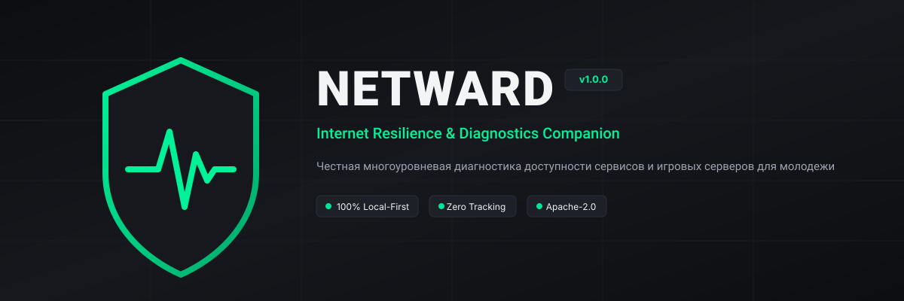

<p align="center">
  
</p>

<p align="center">
  <strong>Современный open-source монитор сетевой устойчивости и диагностический компаньон для нового поколения</strong>
</p>

<p align="center">
  <a href="https://github.com/RovelLabs/new-prpect/actions"></a>
  <a href="https://dotnet.microsoft.com/download/dotnet/8.0"></a>
  <a href="LICENSE"></a>
  <a href="PRIVACY.md"></a>
  <a href="README.md"></a>
</p>

---

## ⚡ Что такое NetWard?

**NetWard** (НетВард) — это локальное приложение для сетевой диагностики и мониторинга доступности сервисов, созданное для подростков, геймеров, студентов и разработчиков, сталкивающихся с нестабильным доступом, блокировками сервисов и искусственным замедлением трафика.

В многопользовательских играх (*Dota 2, CS2, League of Legends*) **Ward** — это предмет, рассеивающий «туман войны» и показывающий реальную обстановку. 

NetWard рассеивает «туман войны» вашего интернет-соединения: вместо догадок о том, почему **упал голосовой канал Discord**, почему **YouTube завис на 144p** или почему **в CS2 подскочил пинг**, NetWard мгновенно проводит измерения по всем уровням модели OSI (Layers 3–7) и сообщает точную причину.

```
+-----------------------------------------------------------------------------------+
| СЕРВИС      | СТАТУС     | ПЕРВИЧНАЯ ПРИЧИНА  | УВЕРЕННОСТЬ| ПИНГ    | РЕКОМЕНДАЦИЯ   |
+-----------------------------------------------------------------------------------+
| Discord     | БЛОКИРОВКА | Сброс ТСПУ по SNI  |    96%     |  32 мс  | Фильтр провайд.|
| YouTube     | ЗАМЕДЛЕНИЕ | Ограничение полосы |    94%     | 2400 мс | CDN дропается  |
| Steam       | РАБОТАЕТ   | Полностью доступен |    98%     |  34 мс  | Всё отлично    |
| CS2 (Warsaw)| ОПТИМАЛЬНО | Потери 0%, пинг ок |    100%    |  31 мс  | Готов к игре   |
+-----------------------------------------------------------------------------------+
```

---

## 🌟 Возможности программы

- **🔬 Многоуровневый анализ сетевых сбоев:** Поэтапно проверяет цепочку `DNS -> TCP SYN -> TLS ClientHello -> HTTP-код -> Скорость потока`. Программа безошибочно отличает:
  - Падение серверов самого сервиса (Global Outage / 503 Service Unavailable);
  - Проблемы с локальным Wi-Fi роутером (Local Gateway Failure);
  - Подмену DNS-ответов провайдером (DNS Poisoning / 127.0.0.1);
  - Активную блокировку ТСПУ с инъекцией TCP RST (`WSAECONNRESET` 10054) при отправке имени сайта в SNI;
  - Искусственное замедление полосы пропускания (Throttling) на узлах CDN Google Video.
- **🎯 Тактический игровой радар:** Измерение многопакетного пинга, джиттера (колебаний задержки) и процента потерь пакетов до европейских серверов Counter-Strike 2, Dota 2, Roblox и Minecraft.
- **🛡️ Сравнение с защищённым DoH:** Проверка ответов системного DNS провайдера против независимых шифрованных серверов Cloudflare (1.1.1.1) и Quad9 (9.9.9.9).
- **⚡ Локальная оптимизация:** Быстрая очистка кэша DNS системы в один клик (`DnsFlushResolverCache`).
- **🔒 Анонимизированный экспорт отчёта:** Экспорт подробного Markdown-отчета с автоматической очисткой личных IP-адресов, имени пользователя Windows и имени компьютера — безопасно для отправки в GitHub issues.
- **🎮 Интерфейс в темном графитовом стиле:** Настоящее нативное Windows-приложение (WPF) без Electron и браузерных оберток, со скоростью отклика 60+ кадров/с.
- **🚫 Никакой рекламы и трекеров:** 100% бесплатно, без подписок, без регистрации аккаунта и без отправки телеметрии на внешние серверы.

---

## 🖥️ Поддержка платформ и загрузка

| Платформа | Интерфейс | Статус | Файл сборки | Инструкция |
| :--- | :--- | :---: | :--- | :--- |
| **Windows 10 / 11** | Нативный Desktop UI (WPF) | ✅ **Стабильно** | [NetWard-v0.1.0-Windows-x64.zip](https://github.com/RovelLabs/new-prpect/releases/download/v0.1.0/NetWard-v0.1.0-Windows-x64.zip) | [Инструкция](RELEASES.ru.md) |
| **Windows x64** | Автономный CLI (Терминал) | ✅ **Стабильно** | [netward-cli-v0.1.0-windows-x64.exe](https://github.com/RovelLabs/new-prpect/releases/download/v0.1.0/netward-cli-v0.1.0-windows-x64.exe) | [Инструкция](RELEASES.ru.md) |
| **Android (8.0–15)** | Мобильный компаньон | 📋 **Спецификация готова** | APK (в сборке) | [Документация Android](docs/ANDROID.ru.md) |
| **Linux / macOS** | Консольный CLI | ✅ **Стабильно** | Сборка из исходников | [Инструкция Linux](docs/BUILD_LINUX.md) |

---

## 📦 Релизы на ПК (Windows)

Для пользователей ПК доступны готовые официальные сборки:
1. **Портативный архив с инсталлятором (Рекомендуется):**  
   Скачайте **[NetWard-v0.1.0-Windows-x64.zip](https://github.com/RovelLabs/new-prpect/releases/download/v0.1.0/NetWard-v0.1.0-Windows-x64.zip)**, распакуйте и запустите `install.cmd` — программа установится в систему и создаст ярлыки на Рабочем столе и в меню «Пуск» без необходимости прав администратора.
2. **Автономный консольный клиент:**  
   Скачайте **[netward-cli-v0.1.0-windows-x64.exe](https://github.com/RovelLabs/new-prpect/releases/download/v0.1.0/netward-cli-v0.1.0-windows-x64.exe)** для запуска из PowerShell / CMD.
3. Полный список файлов, инструкции и контрольные суммы SHA-256 доступны в документе **[RELEASES.ru.md](RELEASES.ru.md)**.

---

## 📱 NetWard на Android (Мобильный компаньон)

Мобильная версия NetWard решает ключевую проблему мобильного интернета в России:
* **Сравнение сотовых операторов и домашнего Wi-Fi:** Выявляет, блокируется ли сервис (Discord, YouTube, голосовые звонки) именно на вышках сотовой связи вашего оператора (МТС, МегаФон, Билайн, Т2) или это сбой домашнего роутера.
* **Мобильный игровой радар:** Замер пинга, джиттера и потерь пакетов для *Roblox Mobile, Standoff 2, Brawl Stars, PUBG Mobile*.
* **Виджет в шторке быстрых настроек:** Проверка состояния сети в один клик без запуска тяжелых приложений.
* **Нулевой разряд аккумулятора:** В отличие от VPN, NetWard не держит тяжелые шифрованные туннели и не разряжает батарею.
* **Без Google Play:** Автономная установка через APK-файл из GitHub Releases и каталогов открытого ПО (F-Droid).
* Полное описание архитектуры и спецификация мобильной версии: **[docs/ANDROID.ru.md](docs/ANDROID.ru.md)**.

---

## 👥 Разработчики и команда проекта

Проект развивается открытой командой инженеров и исследователей под эгидой **RovelLabs**:
* **RovelLabs Engineering Group** ([@RovelLabs](https://github.com/RovelLabs)) — общее руководство, релиз-инженерия и инфраструктура.
* **Senior Software & Systems Architect** — модульная архитектура ядра, асинхронный сокетный движок, система симуляции.
* **Network & Telecommunications Researcher** — исследование эвристик ТСПУ/DPI, детекция сбросов TCP RST и игровой радар.
* **Security & Privacy Engineer** — модель угроз STRIDE, локальное хранение данных без трекеров, авто-маскирование IP-адресов.
* **UI/UX Designer** — графитовая дизайн-система *Graphite & Pulse*, адаптивная верстка и доступность.
* Подробный список участников и благодарности: **[AUTHORS.md](AUTHORS.md)**.

---

## 🔄 Имя репозитория на GitHub

Целевое официальное имя репозитория: **`netward`** (`https://github.com/RovelLabs/netward`).  
Если текущий адрес на GitHub отображается как `new-prpect`, репозиторий переименовывается в настройках GitHub: `Settings -> General -> Repository name -> netward`.

---

## 🚀 Быстрый старт (CLI)

Запуск через командную строку:

```bash
# Полная диагностика всех сервисов
netward check

# Проверка конкретного сервиса (например, Discord или YouTube)
netward check discord

# Запуск игрового радара (пинг, джиттер, потери)
netward game

# Очистка локального кэша DNS
netward flush-dns

# Режим оффлайн-симуляции проверки блокировки ТСПУ
netward simulate discord
```

---

## 🛠️ Сборка из исходного кода

### Требования
- [.NET 8.0 SDK](https://dotnet.microsoft.com/download/dotnet/8.0) или новее.
- Git.

```bash
# Клонирование репозитория
git clone https://github.com/RovelLabs/new-prpect.git
cd new-prpect

# Сборка всего решения
dotnet build NetWard.sln

# Запуск модульных тестов
dotnet test NetWard.sln

# Запуск графического приложения
dotnet run --project src/NetWard.App/NetWard.App.csproj
```

---

## ⚖️ Юридическая безопасность и соответствие 149-ФЗ

NetWard разработан строго как **инструмент сетевой диагностики, мониторинга доступности и локального обслуживания сетевых настроек**. 
Программа не содержит запрещенных туннелей, не распространяет сторонние прокси-серверы и не содержит инструкций по обходу ограничений, подпадающих под действие приказа Роскомнадзора № 168. NetWard является полностью легальной диагностической утилитой, аналогичной *Wireshark*, *PingPlotter* или *OONI Probe*.

---

## 📄 Лицензия

Проект распространяется под открытой лицензией **[Apache License 2.0](LICENSE)**.
