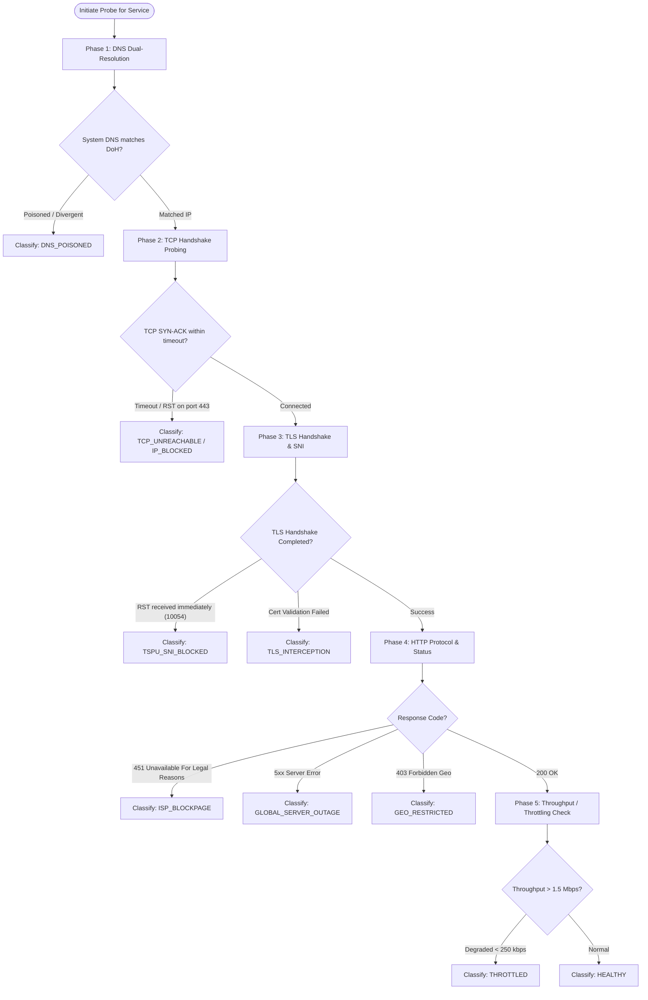

# NetWard System Architecture & Engineering Specification

**Document Metadata:**
- **Product:** NetWard (Core Engine, Desktop App, CLI Runner)
- **Version:** 1.0.0
- **Target Frameworks:** .NET 8.0 LTS / .NET 10.0
- **Architectural Style:** Modular Clean Architecture (Ports & Adapters)

---

## 1. High-Level Modular Architecture

NetWard is designed with strict layer decoupling, separating low-level network socket operations, failure classification, and storage from presentation frontends:

```
+-------------------------------------------------------------------------+
| PRESENTATION LAYER                                                      |
|                                                                         |
|  [NetWard.App (WPF Native Desktop)]      [NetWard.Cli (Terminal Runner)]|
|   - Graphite Dark MVVM Views              - Colored ANSI Terminal Output|
|   - Realtime Gauge & Sparkline Renderers  - Machine-Readable JSON Export|
|   - Windows System Tray Integration       - Headless CI / Server Mode   |
+-------------------------------------------------------------------------+
                                   |
                                   v (Invokes via Public Contracts)
+-------------------------------------------------------------------------+
| CORE DOMAIN & APPLICATION LAYER (NetWard.Core)                          |
|                                                                         |
|  [Service Registry Subsystem]            [Diagnostic & Probing Engine]  |
|   - Built-in Profiles (Discord, YT, etc)  - Layer 3/4 TCP SYN Prober    |
|   - Custom User Services                  - Layer 5/6 TLS Handshake     |
|   - Service Categories & Metadata         - Layer 7 HTTP & Video Stream |
|                                           - DoH DNS Resolver Client     |
|                                           - Game Latency & Loss Radar   |
|                                                                         |
|  [Classification & Intelligence]          [Resilience & Troubleshooting]|
|   - Root-Cause Inference Engine           - Local DNS Flush Adapter     |
|   - Confidence Scorer                     - Gateway Health & MTU Check  |
|   - Ambiguity Resolver                    - Anonymized Diagnostic Export|
+-------------------------------------------------------------------------+
                                   |
                                   v
+-------------------------------------------------------------------------+
| INFRASTRUCTURE & PLATFORM ABSTRACTIONS                                  |
|                                                                         |
|  [Network Abstraction]                   [Local Storage & Redaction]    |
|   - ISocketProber (Live Socket / Sim)     - IStorageManager (Atomic JSON|
|   - IDnsResolver (System DNS & DoH)       - IRedactor (IP & User Mask)  |
|   - IGameRadarProber                      - ILocalizationProvider (RU/EN|
+-------------------------------------------------------------------------+
```

---

## 2. Multi-Stage Diagnostic & Root-Cause Pipeline

When diagnosing reachability for a target service (e.g., Discord or YouTube), NetWard executes a deterministic 5-phase probe sequence:



### Classification Verdicts:
1. `HEALTHY`: 100% operational. Low latency, zero packet loss, valid certificates.
2. `GLOBAL_SERVER_OUTAGE`: Remote cloud server returns 500/502/503 or known public incident reported.
3. `DNS_POISONED`: Local ISP DNS returned `127.0.0.1`, NXDOMAIN, or an ISP redirection IP, while trusted DoH returns valid global IP addresses.
4. `TSPU_SNI_BLOCKED`: TCP connection to IP succeeds, but sending TLS ClientHello with the domain's SNI results in an immediate TCP RST (`WSAECONNRESET` 10054) injected by TSPU.
5. `THROTTLED`: Connection establishes, but stream throughput is artificially capped below 250 kbps with significant packet drop (classic Russian ISP behavior on Google Video).
6. `LOCAL_NETWORK_ISSUE`: Default gateway does not respond; Wi-Fi link has high packet loss; local network disconnected.

---

## 3. Network Simulation Architecture (Offline Testing)

To guarantee that NetWard can be developed, tested, and verified on any developer machine (including environments outside the Russian Federation or in CI containers), NetWard implements `ISocketProber` and `INetworkSimulator`:
- Developer can toggle **Simulation Modes**:
  * `RealNetwork`: Uses actual system sockets and live DNS.
  * `SimulateYouTubeThrottling`: Returns slow throughput and high jitter.
  * `SimulateDiscordBlocked`: Returns successful TCP handshake followed by immediate `SocketException(10054)` on TLS ClientHello.
  * `SimulateGlobalOutage`: Returns HTTP 503 Service Unavailable.
  * `SimulateDnsPoisoning`: Returns divergent DNS resolution.
  * `SimulateHealthy`: Returns crisp 35ms response.

This ensures 100% deterministic unit testing and automated QA in GitHub Actions without relying on unpredictable internet conditions.

---

## 4. Local Storage & Zero-Knowledge Architecture

- **Path:** `%LOCALAPPDATA%\NetWard\`
- **Files:**
  * `settings.json`: Language preference (`ru` or `en`), theme, probe intervals, simulation mode.
  * `custom_services.json`: User-defined service endpoints.
  * `diagnostic_history.json`: Rolling buffer of the last 20 probe runs (for sparkline charts).
- **Atomic File Writes:** Writes to `temp` file followed by an atomic OS file move to guarantee immunity against corrupted cache during unexpected shutdowns.

---

## 5. Security & Redaction Subsystem

The diagnostic export subsystem scans all exported logs and strictly redacts:
- Private RFC 1918 IPv4 addresses (`10.0.0.0/8`, `172.16.0.0/12`, `192.168.0.0/16`).
- Public IPv4 and IPv6 addresses belonging to the host machine.
- Local Windows usernames (`C:\Users\<username>\...` replaced with `C:\Users\[USER]\...`).
- Machine hostname (`Environment.MachineName` replaced with `[HOST]`).

This empowers teens to safely paste full diagnostic reports into public GitHub issues without fear of deanonymization or doxxing.
